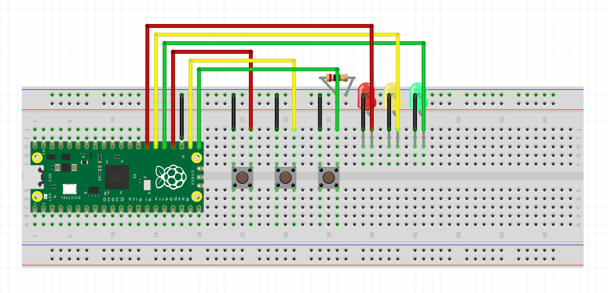

# Simon game

This is a simple simon game that I had to make for a school assignment (hence the french). It is pretty barebones, but I will come back to it at some point in the future to add some code that'll make use of an active buzzer, as well as to remove the stupid part with the menu and player name that was required for the assignment. Anyway

Here's how my Pico was wired:

